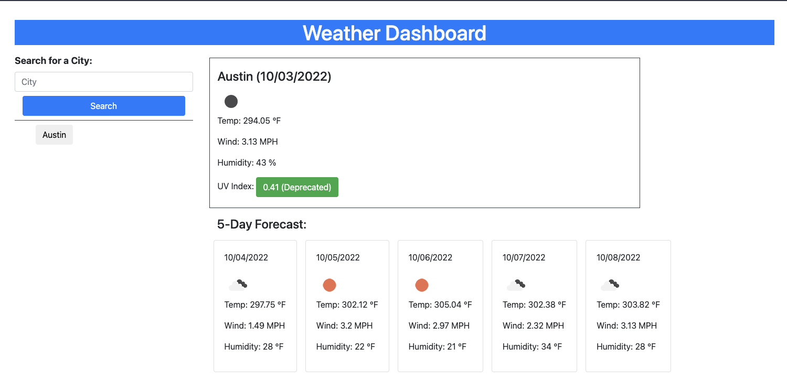

# homework_week6  :book:
---
## Description
This project is to build a weather forecast dashboard application which allows a user to check the weather outlook for multiple cities.

## Installation
N/A

## Usage
To use this application, go to [GitHub Pages](https://yumikakido.github.io/homework_week6/). Enter a city name in an input field on the top left hand side and click on ‘Search’ button underneath. You will then see the current forecast as well as 5-day forecast for that city. 
 

## Credits
N/A

## License
Licensed under the MIT license.  Please refer to the LICENSE in the repo.
